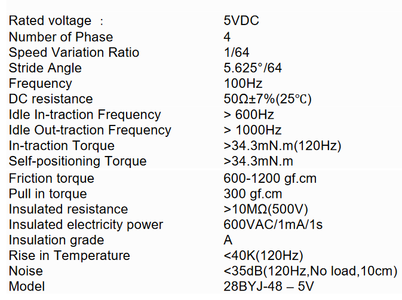

# The *Stepper Motor* Class

In this example we will be using the 28BYJ-48 stepper motor.

## 28BYJ-48 Stepper Motor

### Image


### Specifications



## Sample Setup


### Connections

|Motor Controler Pin|GPIO|
|---|---|
|IN1|5|
|IN2|4|
|IN3|3|
|IN4|2|

## Sample Usage

Note that we use the `stride_angle` given in the specifications table. The `gear_ratio` is the gear ratio between the motor gear and the output shaft gear. The motor controler pins are keyword arguments and have to be named `IN<pin number>`.  
Also make sure to call `clear_pins()` after you are finished using the motor or else some of the motor coils will stay on and consume power and produce heat.

```python
from StepperMotor import StepperMotor

stepper_motor = StepperMotor(
    gear_ratio=32, stride_angle=5.625, IN1=5, IN2=4, IN3=3, IN4=2
)
# Turn the output shaft 180° with a speed of 40°/s
stepper_motor.turn_output_shaft_angular_velocity(180, 40)
stepper_motor.clear_pins()

```
